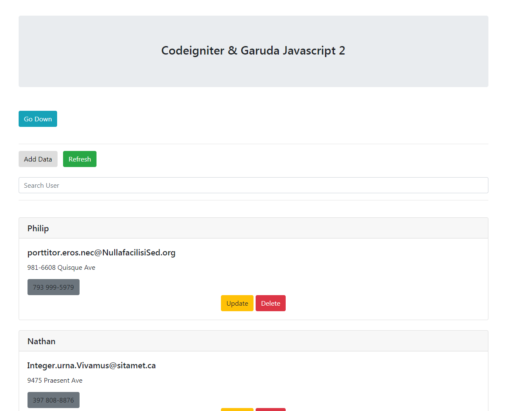
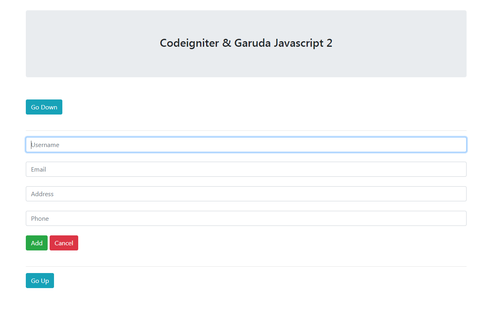
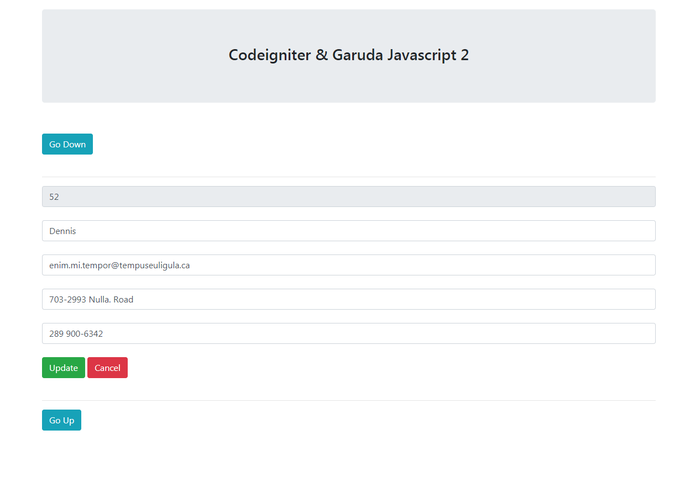

# Codeigniter-and-Garuda-Javascript

Version Codeigniter 3.1.7

Simple CRUD with Codeigniter and Garuda Javascript 2

### Getting Started
1. Clone repository 'git clone https://github.com/lamhotsimamora/Codeigniter-and-Garuda-Javascript.git'
2. Create database name 'db-ci-user_profile'
3. Import data from 'db-ci-user_profile.sql' to database
4. Open in browser 'http://localhost/codeigniter-and-garuda-javascript/'
5. Done !

### Screenshoot

